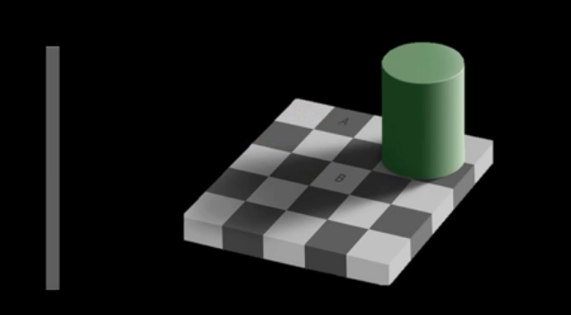

Goals of Computer Vision
To interpret images and understad their context.  This goes beyond simply identifying objects in the image, 
though that is an important part of computer vision itself.  A higher-level goal is actually understanding
the composition of the objects, e.g., automatically inferring a bedroom from identifying pillows, blankets, a bed,
a laundary basket, etc, in an image.  (It can go even further: what century was that image most likely taken?)

* Optical Character Recognition (OCR): easy peasy (used to be considered difficult, but now we're even doing facial expression recognition)
  - e.g., license plate readers
  - Y. LeCun et al., 1989. [Backpropagation Applied to Handwritten Zip Code Recognition](http://www.mitpressjournals.org/doi/abs/10.1162/neco.1989.1.4.541)
* Facial Detection
* Facial Expression Recognition
  - J. Whitehill et al., 2014. [The Faces of Engagement: Automatic Recognition of Student Engagement from Facial Expressions](http://ieeexplore.ieee.org/document/6786307/)
* Object Recognition
  - mobile apps can be used to take a pic of something and automatically retrieve info related to it
* Earth Viewers (3D Modeling)
  - Microsoft's Virtual Earth
  - Google Earth
* Smart Cars 
  - autorecognition of lane lines, signs, quickly-approaching objects 
* Sportsvision
* Microsoft Kinect
* Security & Surveillance
* Medical Imaging

## Why is computer vision hard?
Our brain auto-analyzes things so well, we actually don't even see things as they are all the time.
For example, in the image below, both squares A and B are the same exact color gray.  Our brain basically
considers that info as unimportant, prioritizing the 2-class division of squares --- light and dark.  However,
a photometer measuring the intensity from squares A and B sees those two squares as the same.  Without further 
context, computer vision would identify these two squares as hailing from the same class.

## Computer Vision is NOT Image Processing
Computer vision goes beyond image processing. In the example above, image processing would tell us that squares 
A and B are the same color.  Vision goes beyond this: computer vision of this image demands that the image be
understood --- that the computer correctly identifies squares A and B as being inherently different.

