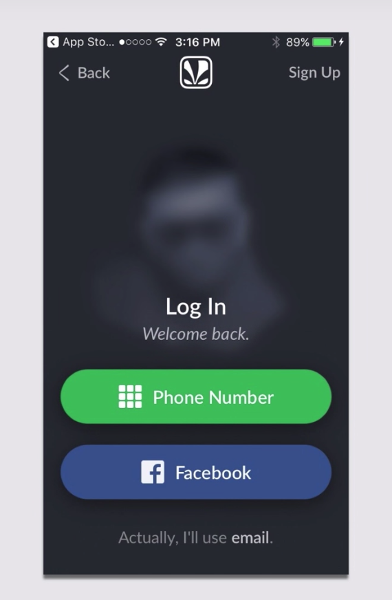
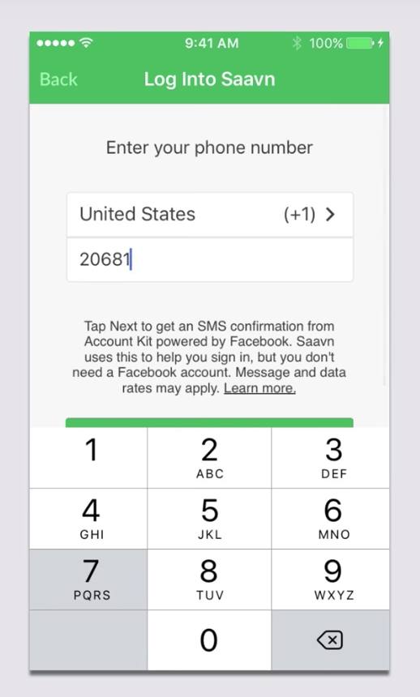
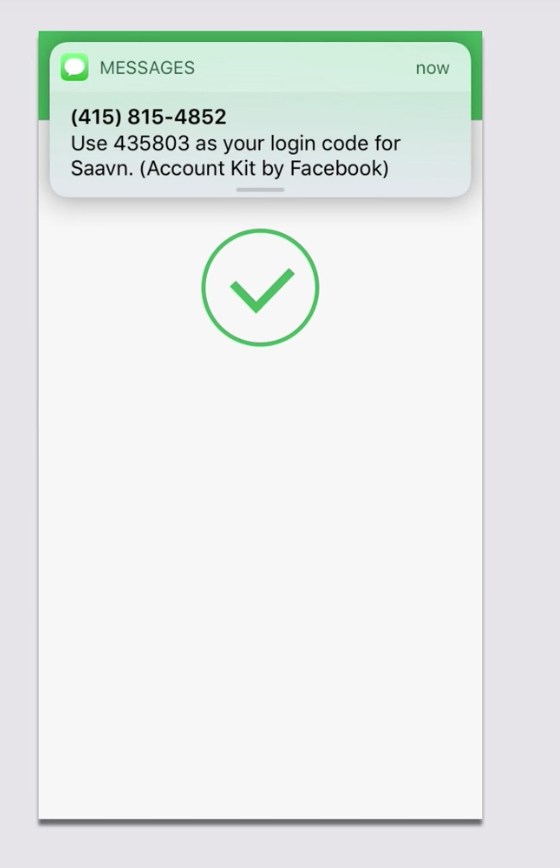
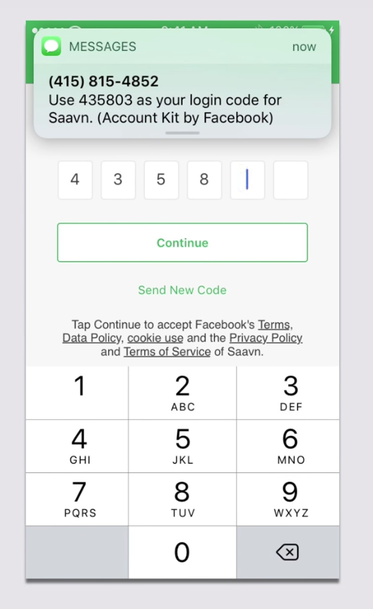
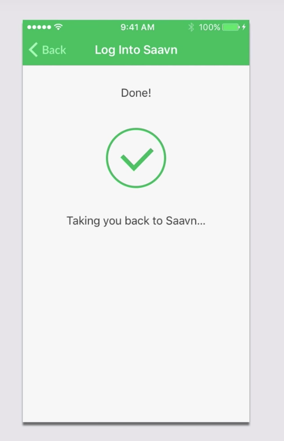

Passwords are relatively terrible security measures: people often use the same ones over and over, and
usually those passwords are easy to remember.  This basically translates to "easy to hack."  There 
are more secure alternatives to passwords that, if implemented correctly, make the login experience 
smoother and stress-free!

## Account Kit
Account Kit allows user to login with just their phone number or email address -- no need for a Facebook
account, as is the case with Facebook Login.  The user's identity is authenticated with no password.  

Account Kit is important: not everyone is on Facebook, and not everyone on Facebook wants their Facebook
account to be associated with your app (as is the case with Facebook Login).

-----------------------------

But is it easy to implement?  Apparently, it is (according to the video!).

-----------------------------

## What does signing in w/ Account Kit look like?

At the beginning of the flow, you can choose if users are allowed to sign in with just their
phone number, just their email, or both.  Many companies choose the phone number flow.

-----------------------------

Lots more to cover in this lesson, but my time is limited right now.  So I'm moving on to the other lessons
and just doing some general info gathering at the moment.

