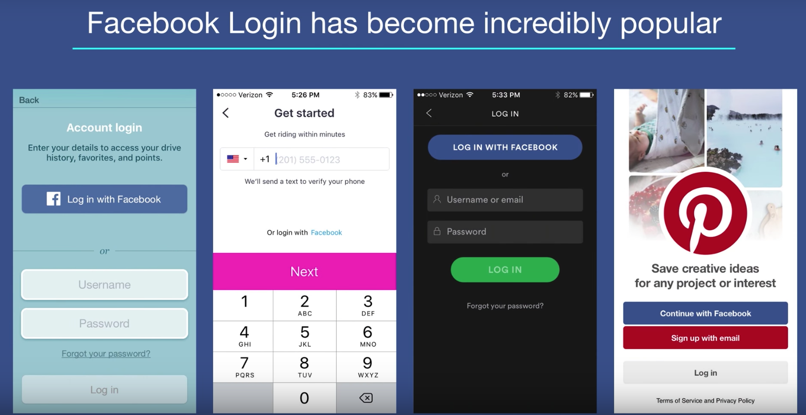

Facebook Login is the most popular login service, followed by Google and Twitter.

How many clicks does it take to sign into a password-dependent app?  The instructors says that
when she counted, it took her 10 clicks to sign into Snapchat and 36 clicks to log into
Slack.  With Facebook Login, it takes only 2 clicks.

You've probably used Facebook Login before!

## Why use Facebook Login
Faster. Easier. More secure. The user does not have an extra password to remember.  You app
does not have to store passwords, which can be incredibly insecure. Can also help you
increase engagement and retention for your app (some statistics are quoted at this point, e.g.,
users spend ~20% more time or so when using Fb Login on one app, ~7% more purchases were made
on another, etc).

Another benefit: Facebook user interact with your app using their real name instead of a made 
up user name.  You can encourage interactions between Facebook friends within your app.  To some
degree, you have access to more user data, which can help you build custom experiences for 
your users.

## How does Facebook Login work?
Fb Login employs a typical OAuth2 flow: 
1. User presses the "Continue with Facebook" button.
2. The client requests access and permissions via the SDK.
3. The SDK Login Manager then present the Login dialog (shows your username, what data the app sees, etc).
4. The user click "Continue as <UserName>"
5. An access token is then returned from Facebook's Graph API
  - the Graph API is the primary way for apps to read and write to the Fb social graph
  - the access token for mobile apps default to long-lived tokens (~60 days)
6. The view is returned to the Login screen, which then recognizes the access token
7. The user flows to the app screen 

Or, in summary:
* The client requests access and permissions
* The user authenticates and approves permissions
* An access token is returned to the client
* User enters the app

