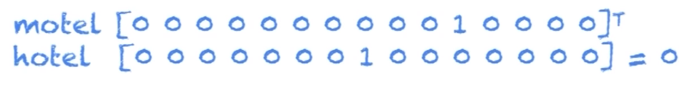

# L02: [Word2Vec](https://www.youtube.com/watch?v=ERibwqs9p38&index=2&list=PL3FW7Lu3i5Jsnh1rnUwq_TcylNr7EkRe6)

WordNet is how people have commonly explored language in the past using Python/NLTK:
```python
from nltk.corpus import wordnet as wn
panda = wn.synset('panda.n.01')
hyper = lambda x: x.hypernyms()
list panda.closure(hyper)
  [Synset('procyonid.n.01'),
    Synset('carnivore.n.01'),
    Synset('placental.n.01'),
    Synset('mammal.n.01'),
    Synset('vertebrate.n.01'),
    Synset('chordate.n.01'),
    Synset('animal.n.01'),
    Synset('organism.n.01'),
    Synset('living_thing.n.01'),
    Synset('whole.n.02'),
    Synset('object.n.01'),
    Synset('physical_entity.n.01'),
    Synset('entity.n.01')]
```

NOTE: If you are installing NLTK on system for first time (e.g., `conda install nltk`), you will receive some errors using
the above code.  You must first use the NLTK downloader to install wordnet:
```python
import nltk
nltk.download('wordnet')
```

However, this discrete word representation approach that wordnet uses is often lacking, e.g., missing synonyms,
missing new words, subjective, and requires human labor develop, adapt, and evolve.

Prior to deep learning approaches, the majority of rules-based and statistical NLP approaches regarded 
words as atomic symbols.  In the language of vectors, this amounts to regarding words as basis vectors
in a very high dimensional space, e.g., cat = [0, 0, 0, ..., 0, 1, 0, ..., 0, 0, 0].  This is called
one-hot encoding in computer science.



So, say your vocabulary is 500k words -- then a traditonal NLP approach would use 500k atomic symbols,
which maps to a 500k-dimensional vector space.  However, if you consider typical problems from 
physics, often a system is represented in a space of much higher dimensionality than its degrees of
freedom require for full represenation of the system, and the equations of motion become much simpler
if one can choose better coordinates.  For example, on the surface of sphere, 3 Euclidean coordinates
can be used, but in a less redundant coordinate system only 2 coordinates are required (e.g., lat, lon).

Given synonyms and antonyms exist, one can imagine that the 500k-dimensional word space is similarly
redundant, and that a transformation might exist to greatly reduce the space's dimensionality. In fact,
this one-hot encoded representation is easily shown to be a poor representation if one continues the
vector space analogy: a dot product should give some sense of similarity between two vectors, but in this
space "cat" and "kitten" are just as similar as "cat" and "couch": 0, or not similar at all.  In other words, 
the space is so over-coordinated that all synomic information is lost -- at least as far as a simple dot
product is concerned (one can imagine engineering a highly-specialized inner product).  

## Distributional Similarity based representations
In this approach, the meaning of a word is found by looking at its neighbors, and in this way a
natural notion of synonyms begins to take shape.  "You shall know a word by the company it keeps,"
said linguist J. R. Firth. Says Wikipedia: "The basic idea of distributional semantics can be summed up in the 
so-called Distributional hypothesis: linguistic items with similar distributions have similar meanings."

* https://en.wikipedia.org/wiki/Distributional_semantics
* https://en.wikipedia.org/wiki/Statistical_semantics

---------------------------

Interesting aside (from Wikipedia): "In recent years, the distributional hypothesis has provided the basis for the 
theory of similarity-based generalization in language learning: the idea that children can figure out how to use words 
they've rarely encountered before by generalizing about their use from distributions of similar words."  This strikes
me as somehow related to one-shot (or zero-shot) learning...but I don't have time to confirm.

Another side note: Latent Semantic Analytis (LSA) uses the distributional hypothesis. I found a set of slides
where the instructor really did a nice job distilling what LSA is: LSA is the application of **singular value
decomposition** to a **term-document matrix** to improve **similarity calculations**. (Btw, a criticism of LSA
is that SVD rotates the matrix along axes of variability in the least-squares sense, which is only truly valid
for normally-distributed data -- which is not the case for language data! There have been workarounds for this
though.)

------------------------------

More on distributional similarity: 
There are some choices to be made here. For example, we can look at neighboring words 2 steps back and 2
steps after the word we are building a representation for.  One can then imagine building a vector for that
word in a similar 500k-dimensional space, but where the vector's values are probability estimates of other 
words being a neighbor of the given word.  In this way, dot products will not necessarily produce a 0 or
a 1 -- we've rotated/transformed the vector representations into a way where "cat" and "kitten" will very
likely prove to be more similar thant "cat" and "couch."  This is sometimes called a "distributed vector
representation" of a word, but the prof notes "distributed representation" here is only loosely related to 
"distributional similarity representation."  In this example, they are basically one and the same, but the
concept of "distributed vector representation" goes beyond this particular case.  I think the terminology
can be better understood as "global" and "local" representations of a word.  In the "local" representation,
the word exists along one dimension in the language space, but in a "global" representation, the word
is "smeared out" along many dimensions of the language space.

The problem in the scenario above is that the space is still 500k dimensional, yet the similarity measures
clearly suggest non-orthogonality of the words.  But the 500k dimensions only exist because we originally
chose a redundant atomic/basis vector representation of words. We have shown that the space is actually 
smaller in size.  (This is where we will stop using the "distribution representation," though will continue
using a "distributed representation".)

Next, we will shrink the space and use "dense representations" of words.

-------------------------

## Directly learning low-dimensional word vectors
* [http://www.jmlr.org/papers/volume3/bengio03a/bengio03a.pdf](2003: Bengio: A neural probabilistic language model)

----------------------------------

## Now: Word2Vec
Main idea: predict between every word and its context words.

Side note: Just learned that "word2vec" and "skip-gram" are the same thing! Well, yes, but not
exactly.  Skip-gram is 1 of 2 algorithms used to implement word2vec (the other being CBoW).

Two main algorithms:
* Skip-Gram: predict context words given target (position independent)
* Continuous Bag of Words (CBoW): predict target word from a bag-of-words context

Two moderately efficient training methods:
* Heirarchical SoftMax
* Negative Sampling

One inefficient, but easy-to-understand "naive" algorithm:
* Naive SoftMax

...each vector has two representation: as a center word, and as a context word.

...at 28mins in, I only have 40mins left for this project today, so I'll stop taking notes and just
watch. Maybe come back to this.

----------------
