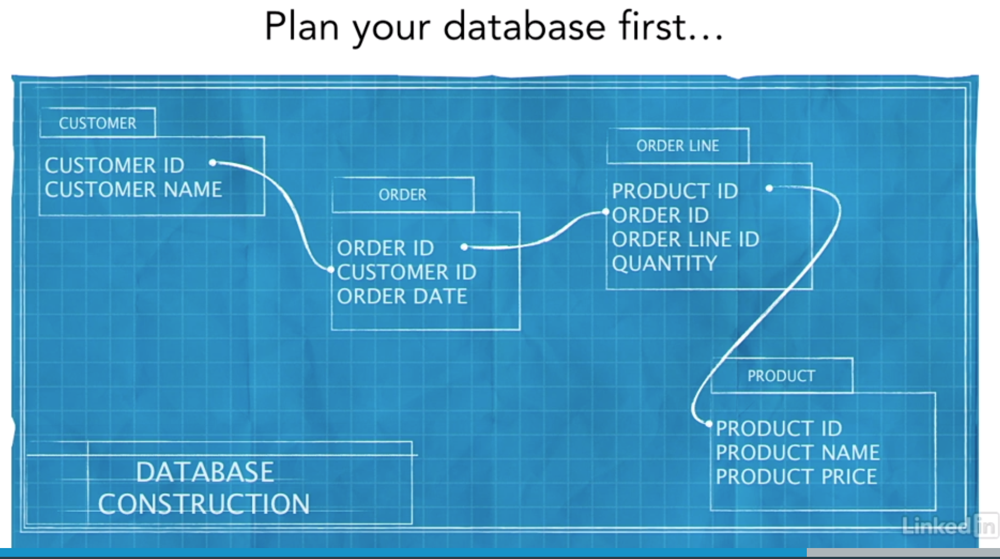
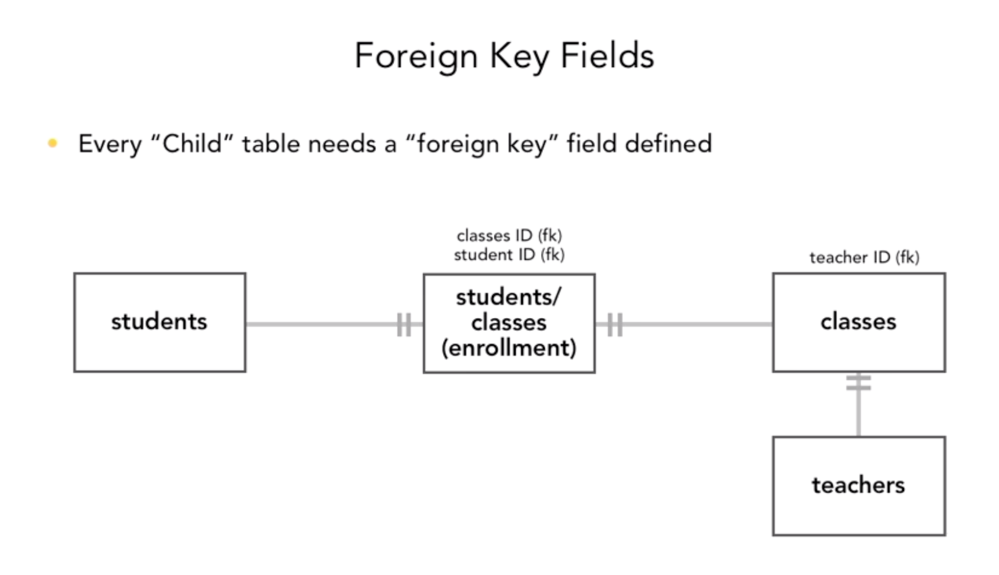

I'm not necessarily interested in FileMaker Pro, but this course seems to have a lot of good basic info.  That
said, this type of software makes it easy for casual users (e.g., your boss) to view and enter contents in the
database...  So it may be worth keeping in mind as I design things going forward.

------------------------------------

A relational database design looks to capture data in multiple, atomic tables that are 
related to each other by keys.  This is in contrast to a flat database design, which
seeks to capture all information in one table.

Benefit of relational model:
* Information is broken down into atomic tables so that info is only entered once,
  eliminating inconsistencies (e.g., a customer name is associated with a customer id in
  the customer table, which is where any other table that references customer gets the
  info from)
  
 
### Relational Modeling
In data modeling, the "atomic tables" are called entities, which become tables inside the 
database. Entities have attributes, which become a table's fields inside the database.



### Relationship Types
In this lecture, only three are discussed:
* one-to-one 
  - TABLE1--|-----|--TABLE2
* one-to-many / many-to-one
  - TABLE1--|-----||--TABLE2
  - This can be thought of as a parent-children relationship, but not like the class-object relationship.  Instead,
    an example is: CUSTOMER--|-----||--ORDERS
* many-to-many
  - TABLE1--||-----||--TABLE2
  
In blogs I've been reading @ vertabelo (e.g., [http://www.vertabelo.com/blog/technical-articles/database-model-for-an-online-store](databse model for an online store), there are other relationships allowed between tables, and the notation
differs.  For example, an endpoint can be "zero-or-one to..." or "zero-or-many to...".

### Design No-No's
A one-to-one relationship between two atomic tables means you split the table too far: they should probably
be the same table.  But this isn't the worst design failure...

Apparently, the worst design failure is leaving in many-to-many relationships between tables.

So.. Why are many-to-many relationships so bad in relational design?

Consider two tables, ACTORS and MOVIES:
* one actor may be in many movies
* one movie may contain many actors

This may appear as a many-to-many relationship, which it is, but that is not how we would
want to represent it in a database.  The reason is that we want these tables to be atomic, e.g.,
a movie title and ID should be in one row in MOVIES, while an actor and actor ID should be 
in one row in ACTORS.  If we allow the relationship to be many-to-many, this translates to having
foreign keys -- e.g., actor_id in MOVIES.  Since there would be more than one actor in a movie,
the MOVIES table would have a movie's title and ID listed many times...  By atomic, I mean that
we want the MOVIES table to be like a dictionary, which only lists a movie once.

Anyway... The solution is a "join table" or "bridge table."

```
ACTORS_DICTIONARY --|-----||--ROLES--||-----|--MOVIES_DICTIONARY
```

| actor | actor_id |
|--|--|
| John Smith | a1 |
| Sally Sue | a2 |
| Ed Benedict | a3 |

| actor_id | movie_id | role | screen_time | salary |
|--|--|--|--|--|
| a1 | m1 | Lt. Dan | 201 | 54000 |
| a1 | m2 | Tiger Johnson | 256 | 109000 |
| a2 | m3 | Ms. Reynolds | 15 | 75000 |
| a3 | m2 | Evil Scientist | 23 | 17000 |

| movie | movie_id | description | rating |
|--|--|--|--|
| Guns and Eagles | m1 | Lt. Dan commands an army of gun-weilding eagles to save the world. | R |
| Action In Action | m2 | If you thought you knew action, you were wrong... | PG-13 |
| Cupcake Farm | m3 | Woman eats organically grown cupcakes straight from the vine. | G |

### Another example
Imagine you want to model a local community college: you write down an entity candidate list that contains
only STUDENTS and CLASSES.  This is a many-to-many relationship though... So the list is not complete.  

STUDENTS--||-----||--CLASSES

You need a bridge table! But what--?  Well, how does a student get into a class?  Answer: a student
enrolls in a class.  So an ENROLLMENT table might help here.

STUDENTS--|-----||--ENROLLMENT--||-----|--CLASSES

In other words:
* a student may be enrolled in many classes
* a class may have many enrolled students

Here, we have a STUDENTS dictionary, a CLASSES dictionary, and a table that relates them... Note that
this course uses the one-to-many relationship, but in other blogs I've read, you might call the 
relationships above one-to-zero-or-many:
* a student may be enrolled in zero or many classes
* a class may have zero or many students enrolled

This gives more clarity to the relationship: 
* a student may have registered for college, but did not enroll in any classes
* a class may be offered by the college, but no student enrolled for it

The possibility of existing without at least one connection is different than something that
cannot exist w/o at least one connection... gnomesayin'?  

## Relational Resolution
When are you done resolving your relational model?  Answer: You are done resolving your relational model
when there only exist one-to-many relationships between your tables.

## Entity Relationship Diagrams (ERDs)
* develop a list of entities (tables) that belong in the data model
  - entities are "things"
* determine and diagram the relationships between those entities
* review the diagram for correctness and consistency
  - normalization
  
One way to develop the entity list is write a paragraph describing what information the database 
should hold, including anything of interest to the business, etc.  Then select out the nouns.

> We want to create a database for tracking **wearables**. The database will need to store information
> about **sensors** associated with the wearable and information on **costs**. 

This is the "entity candidate list."  To determine if it is a good relational model, we will create
an ERD.

## Key Fields
These are just the table fields that link tables...e.g., one table's primary key is used as a foreign key
in another table.



