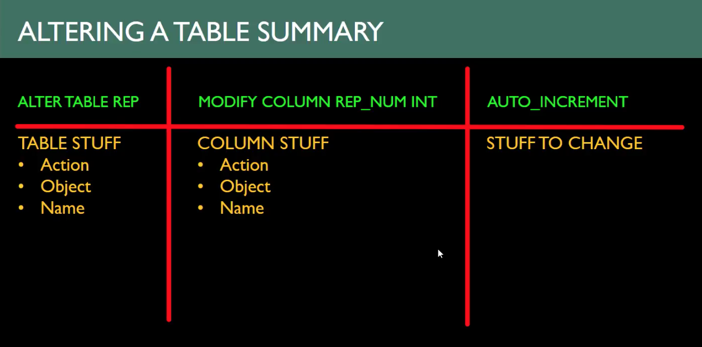

Spring 2018 Video List
* Jan 24, 2018: [Getting familiar with SQL Basics and the Command Line](https://www.youtube.com/watch?v=nECo0OLjG1U)
* Jan 29, 2018: [Diving into the Command Line](https://www.youtube.com/watch?v=ZqpPOoVcljQ)
* Jan 31, 2018: [Command Analysis and Overview](https://www.youtube.com/watch?v=IsfI_CfT0cU)
* Feb 05, 2018: [Select queries](https://www.youtube.com/watch?v=uLl8wh7_sw8)
* Feb 07, 2018: [Group By and Having Clause](https://www.youtube.com/watch?v=r_feMsdpcGg)
* Feb 12, 2018: [Introduction To Joins](https://www.youtube.com/watch?v=cBMv_lLgWzU)
* Feb 14, 2018: [Joins and Subqueries](https://www.youtube.com/watch?v=v9VqzF7Q__0)
* Mar 12, 2018: [Midterm Prep](https://www.youtube.com/watch?v=ZV9UkM1TI5I)
* Mar 26, 2018: [Commit and Rollback](https://www.youtube.com/watch?v=ldRSbXQyJqA)
* Apr 02, 2018: [Control Freak](https://www.youtube.com/watch?v=3HZeg1bMzMA)
* Apr 07, 2018: [Views, Users, Group By and Other Review Stuff](https://www.youtube.com/watch?v=3_4AtgAUCx0)
* Apr 14, 2018: [Triggers and Intro to Workbench](https://www.youtube.com/watch?v=0OpmOkWDUao)
* Apr 18, 2018: [Using Workbench](https://www.youtube.com/watch?v=aNuOYfQ0l8U&t=1790s)

Fall 2018 Playlist
* https://www.youtube.com/watch?v=FsGoU8y_N7A&list=PLGFZsiOu1RwAUdctrj2amGWWuu3FRfp0t
  - as of today (Sep 26), there is only one lecture posted, but it is a playlist, so the link should be good for all

---------------------------------------------------------------------

I'm simultaneously watching over a Coursera course that uses MySQL.  To recap:
* I DL'd MySQL Server (community edition), and chose a password for the root account
* I DL'd MySQL Workbench, and used root account to do some stuff
  - made a new database
  - played w/ ER diagrams
* Brew-installed MySQL command line tools
* Ran a security feature that HomeBrew recommended, which had me secure MySQL...

So, basically, if I want to show my boss something, probably should use WorkBench to make it look
less whacky (command line would likely be off-putting).  

If I want to do quick things / experiment / etc, the command line is my home.

But WorkBench offers features that the command line doesn't really have, e.g., the ER diagrams.

This YouTube course gets the students as proficient as possible at the command line before switching
to WorkBench.  The instructor admires WorkBench, but wants the students to really understand everything
that is going on behind the scenes, especially in case they have to use the commandline on-the-job one day.

---------------------------------------------------------------------

# 01: [Getting familiar with SQL Basics and the Command Line](https://www.youtube.com/watch?v=nECo0OLjG1U)

We are going to build a database, `premiere`.  The instruct showed that he already had
created a database, called `premiere` -- so he dropped it!

```sql
show databases;
drop database premiere;
```

Warning: We just dropped an entire database!  That could have been your employer's database, and it's
just gone.  No warnings were issued, no are-you-sures.  It's just gone.  POINT: Be careful.  You will
want to backup important databases, and maybe even make it more difficult to drop.

That said, let's create `premiere`:
```sql
create database premiere;
```

Now, on the MySQL Server, you can have multiple databases. For example, you start with a bunch of default
ones (e.g., `show databases from mysql;` or `show databases from information_schema`). So to create tables within
a database, you have to tell the server which database your SQL commands correspond to explicitly each time, or
you can "go into" a particular database.

Method 1: Explicitly choose database from root directory
```sql
create table premiere.newtbl (a int, b varchar(3));
show tables from premiere;
show columns from premiere.newtbl;
drop table premiere.newtbl;
show tables from premiere;
```

Method 2: Go into a particular database and obviate the need for prefixes
```sql
use premiere;
create table newtbl (a int, b varchar(3));
show tables;
show columns from newtbl;
drop table newtbl;
show tables;
```

In this video, the instructor uses the second method.  Here is the first table we officially create:
```sql
CREATE TABLE rep (
  rep_num CHAR(2) PRIMARY KEY,
  last_name CHAR(15),
  first_name CHAR(15)
  street CHAR(15),
  city CHAR(15),
  state CHAR(2),
  zip CHAR(5),
  commission DECIMAL(7,2),
  rate DECIMAL(3,2)
);
```


Pro Tip: Use a text editor w/ .sql extension to write up your queries; then just cNp them into MySQL. (The extension is
key for helping your text editor do syntax highlighting.)

---------------------------------------------------------------------

# 02: [Diving into the Command Line](https://www.youtube.com/watch?v=ZqpPOoVcljQ)

SQL Overview: CRUD
* Create/Write Stuff (CREATE, ADD, INSERT)
* Read/Display Stuff (SHOW, SELECT)
* Update/Modify Stuff (ALTER, MODIFY, UPDATE)
* Delete/Remove Stuff (DROP, DELETE)

You (CREATE, DROP, ALTER, SHOW) tables and databases...

You (ADD, DROP, MODIFY, SHOW) COLUMNS

You (INSERT, SELECT, UPDATE, DELETE) records ...

|        | Databases | Tables | Columns | Records |
|--|--|--|--|--|
| Create | CREATE | CREATE | ADD | INSERT |
| Read | SHOW | SHOW | SHOW | SELECT |
| Update | ALTER | ALTER | MODIFY | UPDATE |
| Delete   | DROP | DROP | DROP | DELETE |


```sql
CREATE TABLE bob (
  id int PRIMARY KEY AUTO_INCREMENT,
  name CHAR(50)
);
SHOW columns FROM bob;
  +-------+----------+------+-----+---------+----------------+
  | Field | Type     | Null | Key | Default | Extra          |
  +-------+----------+------+-----+---------+----------------+
  | id    | int(11)  | NO   | PRI | NULL    | auto_increment |
  | name  | char(50) | YES  |     | NULL    |                |
  +-------+----------+------+-----+---------+----------------+
```

Since we set auto_increment, we do not need to manually specify an ID... That said, to use that
feature, we have to explicitly list column names in the INSERT statement...  You can also specify 
an ID manually w/ this feature set: if the ID is not taken, it will be used; if the ID is taken, you
will get an error.  The increment will always occur from the largest integer ID.

```sql
INSERT INTO bob VALUES (9, 'Bill'), (2, 'Jill');
INSERT INTO bob (name) VALUES ('Lill');
SELECT * FROM bob;
  +----+------+
  | id | name |
  +----+------+
  |  2 | Jill |
  |  9 | Bill |
  | 10 | Lill |
  +----+------+
```

You can start from any integer ID, e.g., if starting from 1 is "embarrassing" for business.

```sql
ALTER TABLE bob AUTO_INCREMENT = 1000;
INSERT INTO bob (name) VALUES ('Phil');
SELECT * FROM bob;
  +------+------+
  |  id  | name |
  +------+------+
  |    2 | Jill |
  |    9 | Bill |
  |   10 | Lill |
  | 1000 | Phil |
  +------+------+
```

It is possible to go back and change the IDs for the previous entries, but in general it is not
a good idea to change values for a primary key.  That said, the syntax to do so is:

```sql
UPDATE bob SET id = 997 WHERE id = 2;
UPDATE bob SET id = 998 WHERE id = 9;
UPDATE bob SET id = 999 WHERE id = 10;
```

To delete rows from a table:
```sql
DELETE FROM bob WHERE id > 999;
```

General Warning: The auto_increment feature will never use the same index twice, even if that row is removed, which is good!  However,
at the commandline, you can manually give a new user a previously used ID...which is bad!  This can screw up downstream
reporting and analytics having two different users with the same ID.

```sql
INSERT INTO bob (name) VALUES ('Kril');
SELECT * FROM bob;
  +------+------+
  | id   | name |
  +------+------+
  |  997 | Jill |
  |  998 | Bill |
  |  999 | Lill |
  | 1001 | Kril |
  +------+------+
```

You can add a column like so:
```sql
ALTER TABLE bob ADD COLUMN email CHAR(50);
-- update the records w/ emails
UPDATE bob SET email='jillbalz@someEmailProvider.io' WHERE id = 997;
UPDATE bob SET email='b.turpenderp@someEmailProvider.io' WHERE id = 998;
UPDATE bob SET email='lil.lil@someEmailProvider.io' WHERE id = 999;
-- look at 'em
SELECT * FROM bob;
  +------+------+-----------------------------------+
  | id   | name | email                             |
  +------+------+-----------------------------------+
  |  997 | Jill | jillbalz@someEmailProvider.io     |
  |  998 | Bill | b.turpenderp@someEmailProvider.io |
  |  999 | Lill | lil.lil@someEmailProvider.io      |
  | 1001 | Kril | NULL                              |
  +------+------+-----------------------------------+
```

In MySQL, you can add a column anywhere amongst the existing columns.  This is in contrast to my experience
with Redshift, where you could only add columns to the end of the column list (and do a bunch of backflips if
you really cared about column order).

```sql
ALTER TABLE bob RENAME COLUMN name TO first_name;
ALTER TABLE bob ADD COLUMN last_name CHAR(50) AFTER id;
SELECT * FROM bob;
  +------+-----------+------------+--------------------------------+
  | id   | last_name | first_name | email                          |
  +------+-----------+------------+--------------------------------+
  |  997 | NULL      | Jill       | jillbalz@someEmailProvider.io  |
  |  998 | NULL      | Bill       | b.turpenderp@someEmailProvider |
  |  999 | NULL      | Lill       | lil.lil@someEmailProvider      |
  | 1001 | NULL      | Kril       | NULL                           |
  +------+-----------+------------+--------------------------------+
```

### Misc Commands
Sometimes you might forget what database you are in... 

```sql
SELECT DATABASE()
  +------------+
  | database() |
  +------------+
  | premiere   |
  +------------+
```

For a lot more info, just enter `status`:

```sql
STATUS
  --------------
  mysql  Ver 8.0.12 for osx10.13 on x86_64 (Homebrew)

  Connection id:		35
  Current database:	premiere
  Current user:		root@localhost
  SSL:			Not in use
  Current pager:		stdout
  Using outfile:		''
  Using delimiter:	;
  Server version:		8.0.12 MySQL Community Server - GPL
  Protocol version:	10
  Connection:		Localhost via UNIX socket
  Server characterset:	utf8mb4
  Db     characterset:	utf8mb4
  Client characterset:	utf8mb4
  Conn.  characterset:	utf8mb4
  UNIX socket:		/tmp/mysql.sock
  Uptime:			6 hours 3 sec

  Threads: 2  Questions: 659  Slow queries: 0  Opens: 355  Flush tables: 2  Open tables: 325  Queries per second avg: 0.030
--------------
```

# 03: [Command Analysis and Overview](https://www.youtube.com/watch?v=IsfI_CfT0cU)

In a production database, you definitely do not want to change a column's type or change table structures too much, 
lest ye tempt the wrath of chaos doth ensue (if that makes sense).

HOWEVER, you can do it...just like you can try eating battery acid.  This is how:
```sql
use premiere;
ALTER TABLE rep MODIFY COLUMN rep_num INT AUTO_INCREMENT;
```



More ALTER commands:
```sql
ALTER TABLE rep MODIFY COLUMN last_name CHAR(15) DEFAULT 'Billy Bob';
ALTER TABLE rep MODIFY COLUMN last_name CHAR(15) DEFAULT NULL;
-- create a primary key
ALTER TABLE rep ADD PRIMARY KEY (rep_num);
-- drop a primary key
ALTER TABLE rep DROP PRIMARY KEY;
-- create a dual primary key
ALTER TABLE mytabl ADD PRIMARY KEY (col1, col2);
```

There are keywords that are similar to MODIFY, and used in place of MODIFY, that you should be aware of:
* CHANGE
  - CHANGE can do one more thing than MODIFY: change the column's name
  - however, this feature is burdensome: if you're not changing the name, you need to write the column's name twice
  - moreover, renaming can be done w/ a RENAME command ... so know MODIFY, be aware of CHANGE
* ALTER
  - MODIFY can do everything that ALTER can do, so no need to learn both

---------------

### Running SQL commands from source files
Say you create a text file w/ some repeatable commands.  You can run it from the MySQL environment:
```sql
souce path/to/my/file.sql
```

